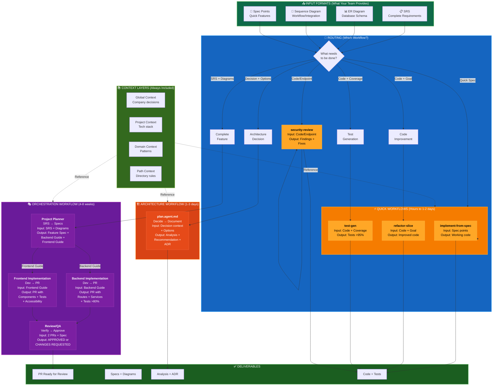

# Communication Workflow Diagram

Complete visual guide showing how your team communicates with Copilot agents.

---

## Full Workflow Map



---

## Workflow Layers Explained

### 📥 Input Layer (Top)

Your team provides one or more of these:

| Format | Used For | Example |
|--------|----------|---------|
| 📋 **SRS** | Complete feature specs | "User Dashboard with analytics" |
| 📊 **ER Diagram** | Database structure | Users → Posts → Comments relationships |
| 🔄 **Sequence Diagram** | Complex workflows | Login flow with 2FA |
| 📝 **Spec Points** | Quick features | "Add email to profile" |

---

### 🎯 Routing Layer (Decision Tree)

Determines which workflow to use:

```
What needs to be done?

1. Complete feature + full SRS
   → Use Orchestration Workflow (4-8 weeks)

2. Technology decision (Redis vs MongoDB?)
   → Use Architecture Workflow (1-3 days)

3. Quick feature/bug fix + spec points
   → Use Quick Workflows (hours-2 days)
   
4. Improve existing code
   → Use refactor-slice prompt

5. Need test coverage
   → Use test-gen prompt

6. Security check needed
   → Use security-review prompt
```

---

### 🎭 Orchestration Workflow (4-8 weeks)

**For**: Complete feature development from SRS to production

**Flow**:
```
       ┌─────────────────┐
       │  SRS + Diagrams │
       └────────┬────────┘
                ↓
    ┌───────────────────────┐
    │ Project Planner Agent │
    │  SRS → Specs + Guides │
    └────────┬────────┬─────┘
             ↓        ↓
       ┌─────────┐ ┌──────────┐
       │ Backend │ │ Frontend │
       │  Guide  │ │  Guide   │
       └────┬────┘ └─────┬────┘
            ↓            ↓
    ┌──────────────┐   ┌────────────────┐
    │  Backend     │   │  Frontend      │
    │  Implementation  │  Implementation│
    │  Agent (PR)  │   │  Agent (PR)    │
    └──────┬───────┘   └────────┬───────┘
           │                    │
           └─────────┬──────────┘
                     ↓
          ┌──────────────────┐
          │  Review/QA Agent │
          │ Verify + Approve │
          └────────┬─────────┘
                   ↓
            ✅ APPROVED PRs
```

**Timeline**: 4-8 weeks total
- Planning: 1-2 weeks
- Implementation: 2-3 weeks  
- Review: 1 week
- Adjustments: 1-2 weeks

---

### 🏗️ Architecture Workflow (1-3 days)

**For**: Making technical/architectural decisions

**Flow**:
```
┌────────────────────┐
│ Decision Context + │
│ Options to Eval    │
└─────────┬──────────┘
          ↓
   ┌────────────────┐
   │  plan.agent.md │
   │  Analyze + Rec │
   └────────┬───────┘
            ↓
  ┌──────────────────┐
  │ Analysis + ADR   │
  │ + Roadmap        │
  └──────────────────┘
```

**Uses for**:
- Database technology choice
- Caching strategy
- Authentication approach
- Architecture migrations
- Tech stack decisions

---

### ⚡ Quick Workflows (Hours to 2 days)

**For**: Rapid implementation and improvements

**4 Quick Paths**:

```
📝 Spec Points
        ↓
   implement-from-spec
        ↓
   ✅ Working Code

🔧 Code + Goal
        ↓
   refactor-slice
        ↓
   ✅ Improved Code

📊 Code + Coverage
        ↓
   test-gen
        ↓
   ✅ Tests >95%

🔐 Code/Endpoint
        ↓
   security-review
        ↓
   ✅ Findings + Fixes
```

---

### 📚 Context Layer (Always Included)

Every agent uses these context files:

```
docs/_global/context.md       ← Company-wide decisions
docs/projects/{project}/context.md ← Project-specific tech
.github/instructions/         ← Domain patterns
.github/instructions/paths/   ← Directory-specific rules
```

Examples called in each workflow:
- ✅ Backend Implementation → Uses backend context + API instructions
- ✅ Frontend Implementation → Uses frontend context + component instructions
- ✅ Security Review → Uses security best practices from context

---

## Real Examples

### Example 1: Complete Feature (Orchestration Path)

```
Team provides:
├─ SRS: "User Dashboard"
├─ ER Diagram: User, Posts, Analytics tables
└─ Sequence: User login → Load dashboard → Display metrics

Flow:
  SRS → Project Planner
       ├─ Backend guide: "Endpoint /api/analytics, db schema..."
       └─ Frontend guide: "Components: Dashboard, Chart, Filters..."
            ↓
       Backend Implementation ← Backend guide
       Frontend Implementation ← Frontend guide
            ↓
       Review/QA: Verify both meet spec
            ↓
       ✅ Deploy to production

Timeline: 4-8 weeks
```

### Example 2: Architecture Decision

```
Team provides:
├─ Problem: "API responses too slow"
├─ Options: 
│   1. Add Redis caching
│   2. Database optimization
│   3. HTTP caching headers
└─ Constraints: "Want simple, team knows Redis"

Flow:
  Decision → plan.agent
       ↓
  Analysis + Recommendation: "Use Redis (simplest, proven)"
       ↓
  ADR documented
       ↓
  ✅ Implementation roadmap

Timeline: 1-3 days
```

### Example 3: Quick Implementation

```
Team provides:
├─ Spec: "Add email to user profile"
├─ Endpoint: "PUT /api/users/{id}/email"
└─ Validation: "Email must be unique, valid format"

Flow:
  Spec → implement-from-spec
       ↓
  ✅ PR with endpoint + tests

Timeline: 1-2 days
```

---

## Using the Diagram

When choosing which workflow to use:

1. **Check your input**: Do you have SRS + diagrams? → Orchestration
2. **Check your goal**: Making a decision? → Architecture
3. **Check complexity**: Quick feature? → Quick workflow
4. **Check action**: Need to improve code? → refactor-slice
5. **Check coverage**: Need tests? → test-gen
6. **Check security**: Need review? → security-review

---

## Connected Files

Reference these while working:

- **Communication Guide**: [COMMUNICATION-GUIDE.md](COMMUNICATION-GUIDE.md)
- **Agent Reference**: [.github/agents/AGENT-REFERENCE.md](.github/agents/AGENT-REFERENCE.md)
- **Orchestration Workflow**: [.github/agents/orchestration/WORKFLOW.md](.github/agents/orchestration/WORKFLOW.md)
- **Handoff Protocol**: [.github/agents/orchestration/HANDOFF-PROTOCOL.md](.github/agents/orchestration/HANDOFF-PROTOCOL.md)

---

**Last Updated**: February 23, 2026
